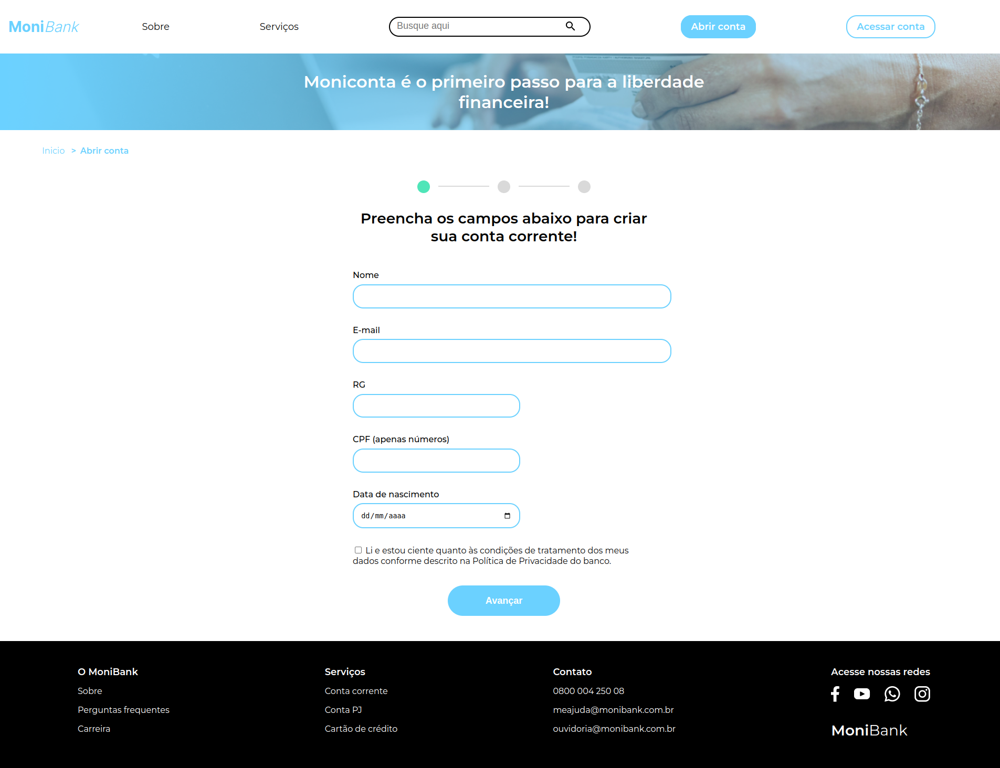
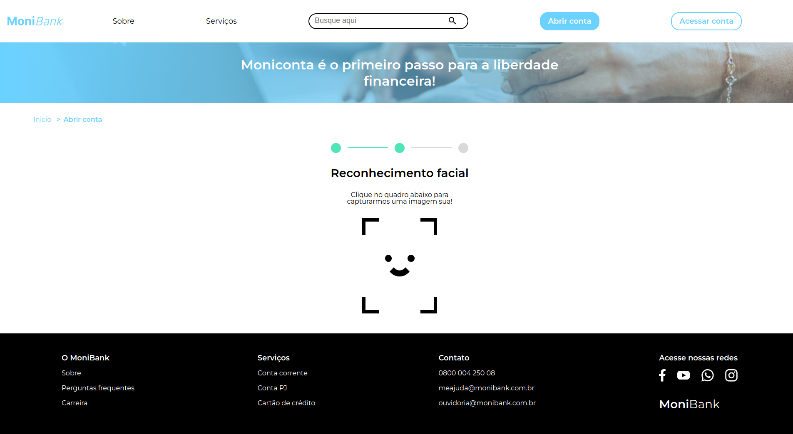
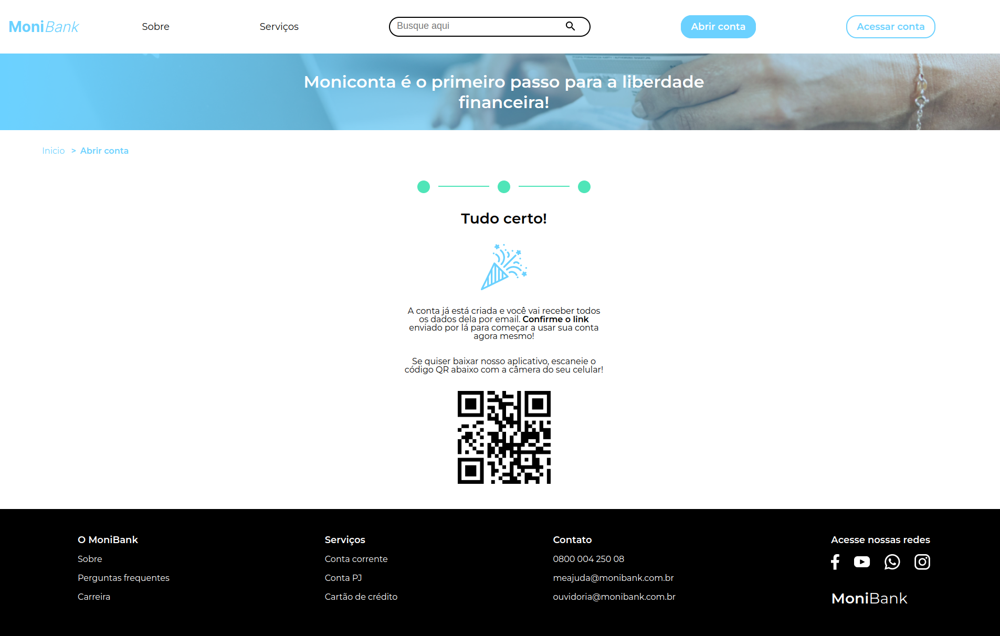

# MoniBank

Site de banco com um formulário para a abertura de conta.

| :placard: Vitrine.Dev |     |
| -------------  | --- |
| :sparkles: Nome        | **MoniBank**
| :label: Tecnologias | HTML, CSS e JavaScript
| :rocket: URL         | https://monibank-cyan.vercel.app/
| :fire: Desafio     | -

## Detalhes do projeto

Projeto usando HTML, CSS e JavaScript com foco na prática de validações nos campos do formulário de cadastro. Nesse projeto aprendi:  
• Como aplicar atributos de validação de formulário com HTML5;  
• Construir validações para os dígitos verificadores do CPF;  
• Implementar validações de maioridade a partir da comparação de datas;  
• Customizar mensagens de erro para cada tipo de campo do formulário;  
• Integrar a webcam do usuário em uma tela do navegador;  
• Capturar fotos via webcam;  

## Screenshot

  </img>
  </img>
  </img>
  </img>

